# WorkReporter

WorkReporter is a simple web application written in PHP that allows employers to control employees' work time.
Application provides simple interface for easy interaction with the system, all the data are stored in MySQL database.
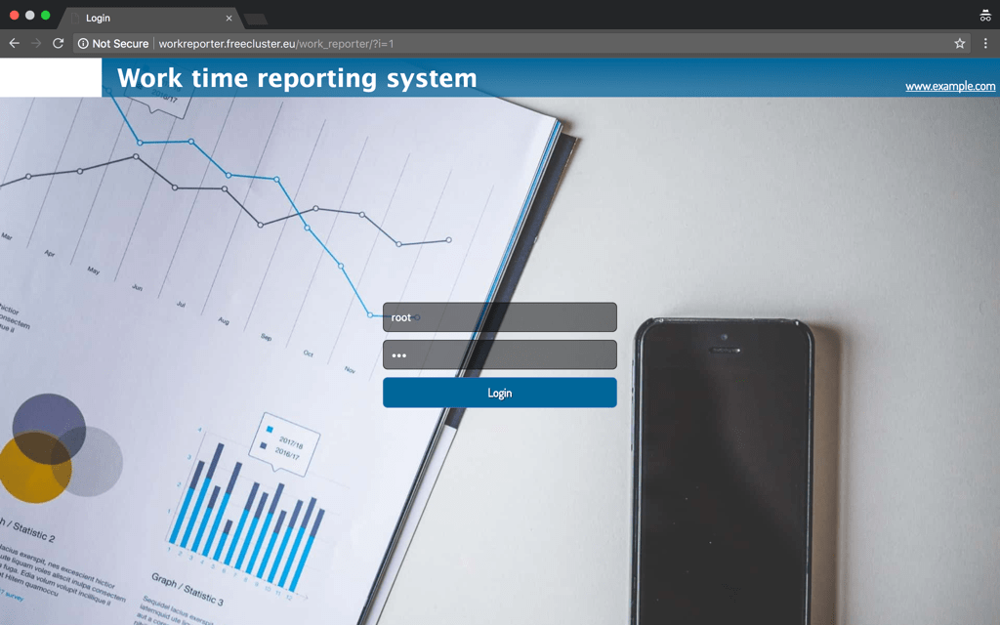

## Administartor account

<p align="middle"> Reports</p>
Provides list of all the work time reports in the database, that can be filtered, edited or removed.
Using "Download CSV" button, system generate MS Excel file, same as current displayed table view.
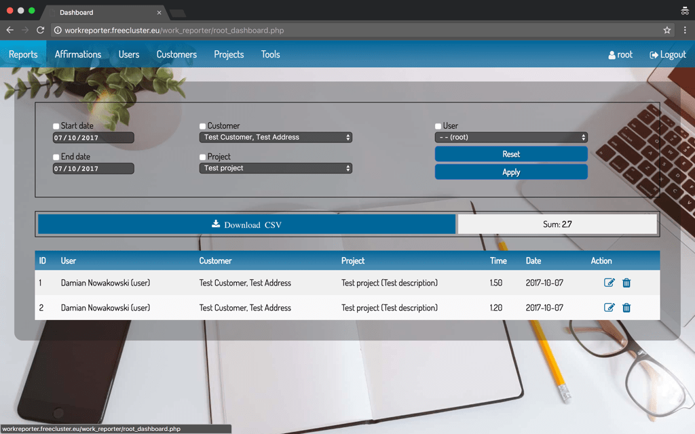

<p align="middle"> Affirmations</p>
Provides list of employees for selected day,which affirmed reporting day or did not affirmed it. 
Affirmations can be manually confirmed or cancelled by administrator. 
Days sumbitted by employee as a vacation days, are affirmed automatically (than reported time value is "vacation").  
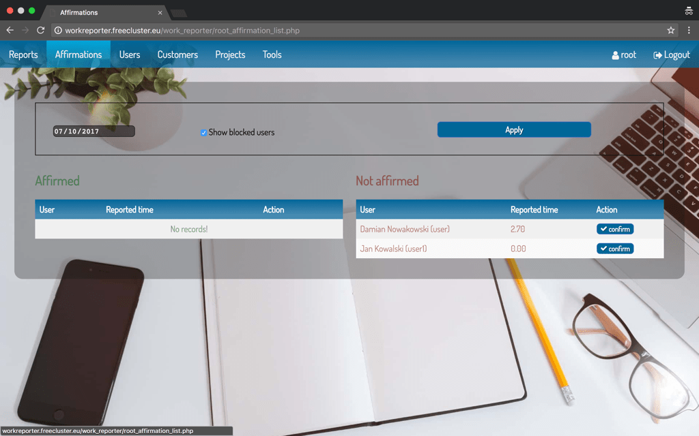

<p align="middle"> Users</p>
Provides list of users that can be edited, blocked or removed completly.
Users with "A" image are administrators, remaining ones are employees. 
Grayish records marks users that are blocked. Blocked user exists in the database but cannot login to the system.
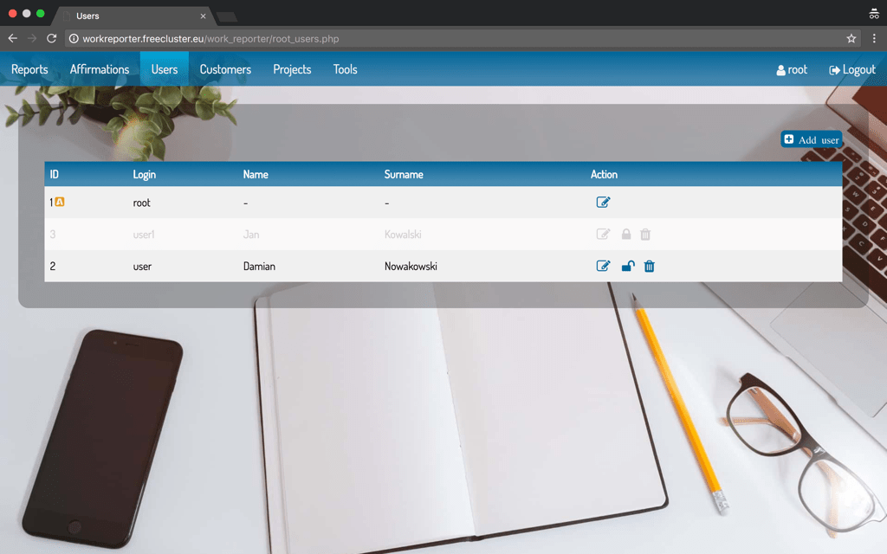
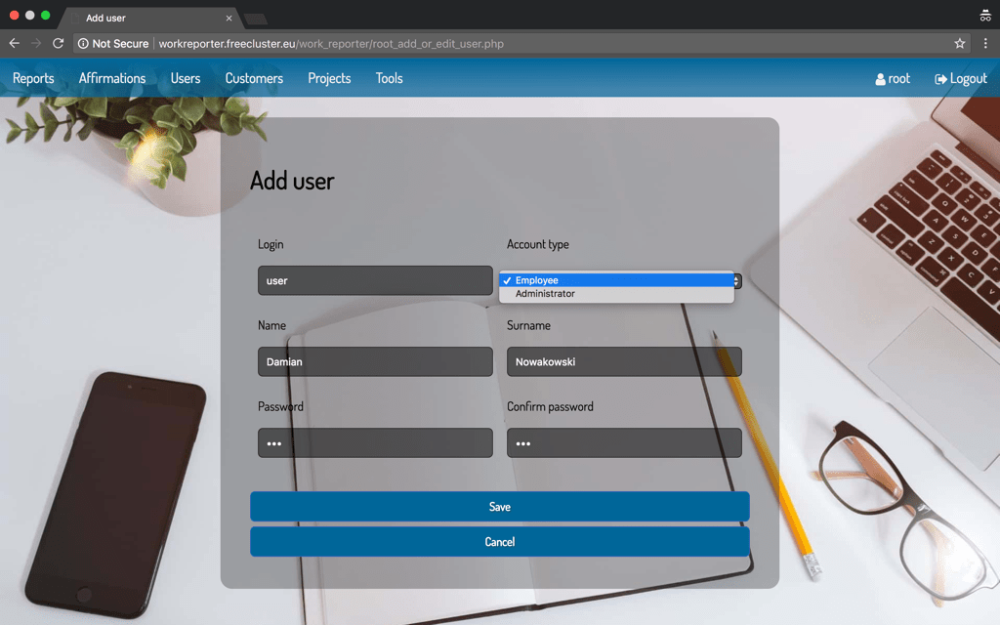

<p align="middle"> Customers</p>
Provides list of customers that can be edited, blocked or removed completly.
Grayish records marks customers that are blocked. Blocked customer exists in the database but employees cannot report work time for it.
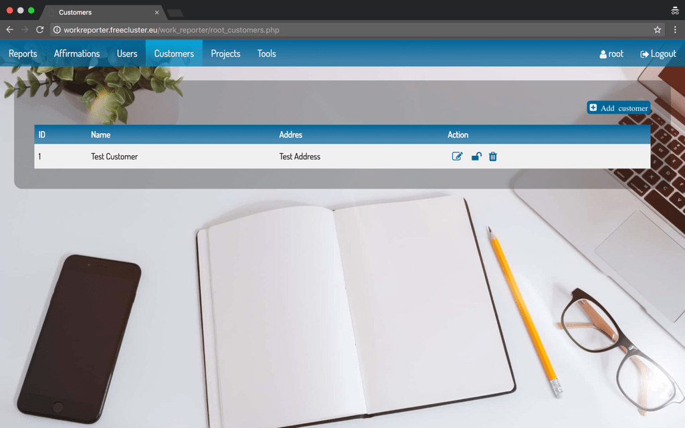
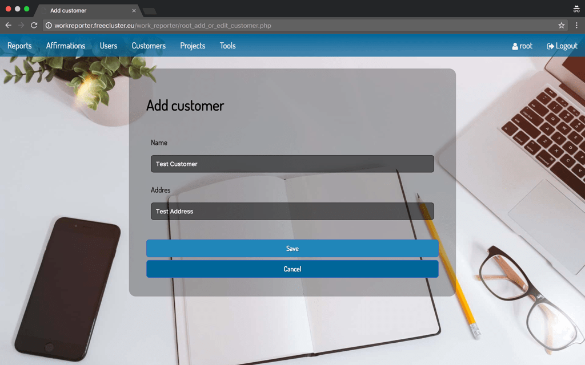

<p align="middle"> Projects</p>
Provides list of projects that can be edited, blocked or removed completly.
Grayish records marks projects that are blocked. Blocked project exists in the database but employees cannot report work time for it.
Project can be invidual (available for one customer only) or general (available for every cutomer in the database).
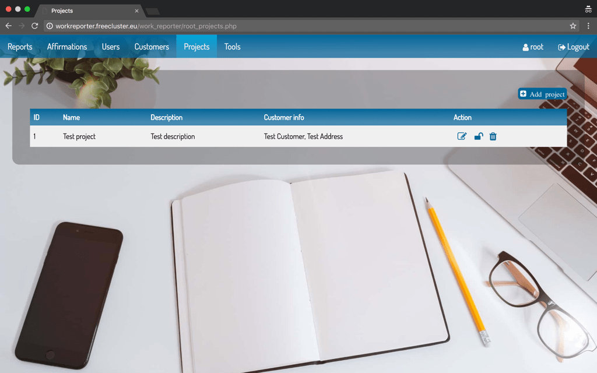
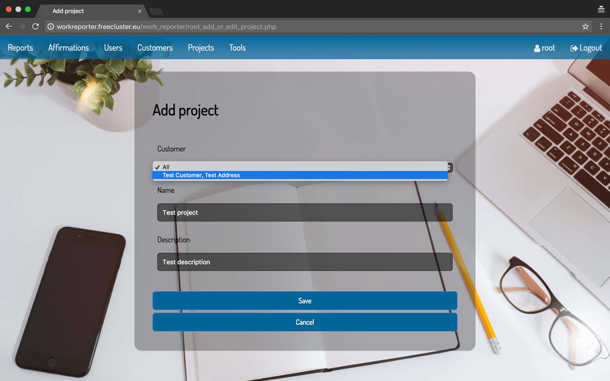

<p align="middle"> Tools</p>
Provides tools for managing database.
Backup button allows to download *.sql file, that is backup of current database.
Clear button allows to clear completly database data. The initial root user will be created automatically.
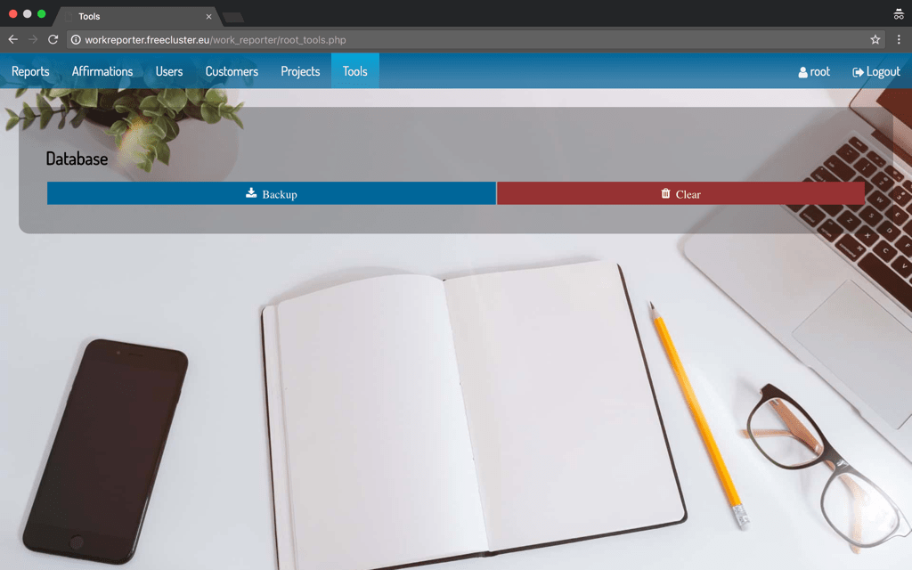

## Employee account

<p align="middle"> Dashboard</p>
Provides list of reported activities for selected date and logged employee.
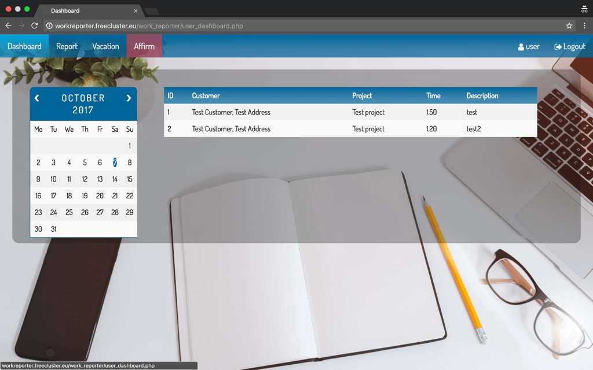

<p align="middle"> Report</p>
Allows to report worked time for current day and selected project.
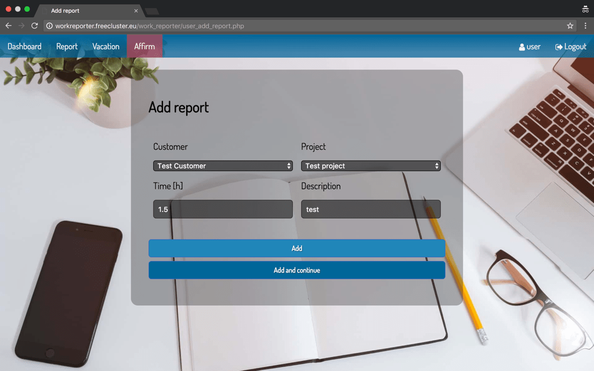

<p align="middle"> Vacation</p>
Provides list of submitted vacation days and allows to submit another ones.
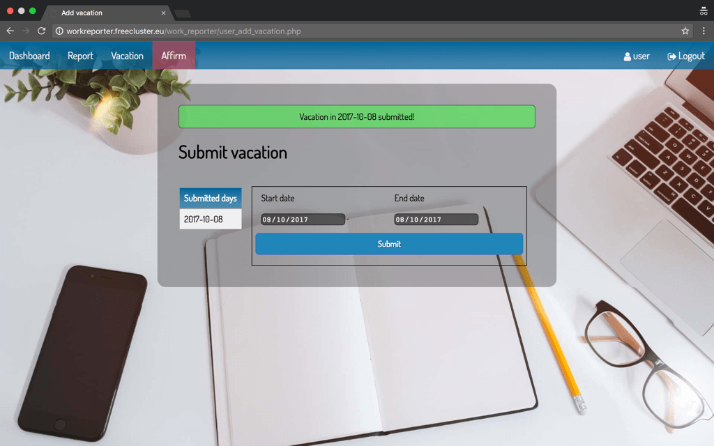

<p align="middle"> Affirm</p>
Allows employee to affirm current reporting day. Affirm tab will be red until affirmation did not be made.
Vacation days are affirmed automatically. After user affirmation, no report can be added in a current day.
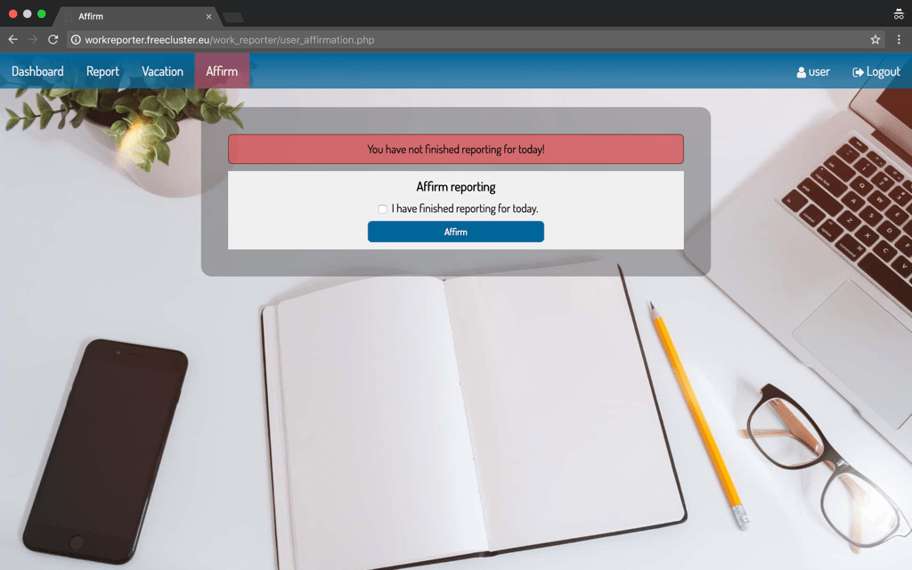

## Database structure

<div align="middle">
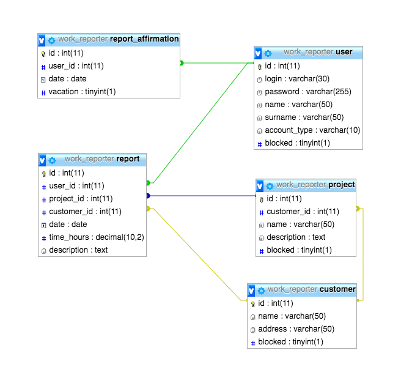 </center>
</div>

## Extra information

Database dump file creates one initial administrator account.
```
  login: root
  password: zaq
```

Do not forget change database configuration file [utils/DatabaseManager.php](https://github.com/thirteendollars/WorkReporter/blob/master/utils/DatabaseManager.php).
Default configuration is as below:
```
  private $host = "localhost";
  private $db_user = "root";
  private $db_password = "psswd_to_change";
  private $db_name = "work_reporter";
```
